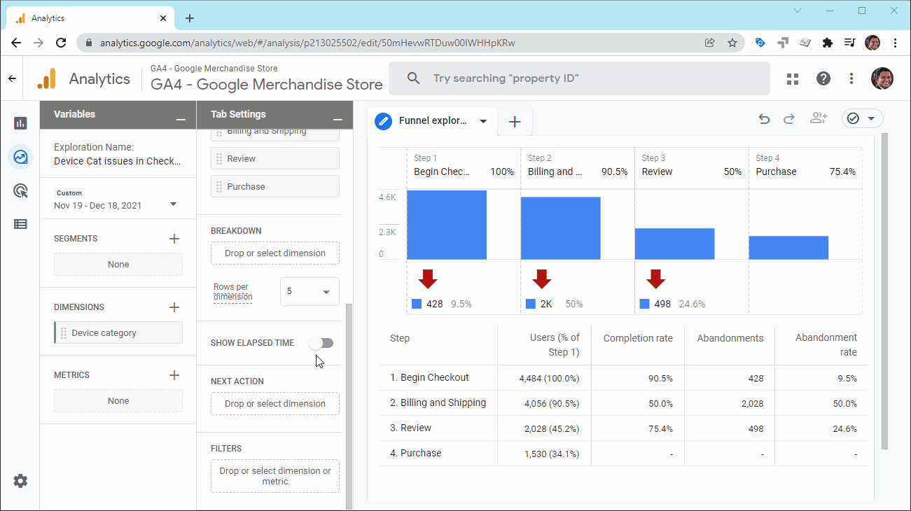
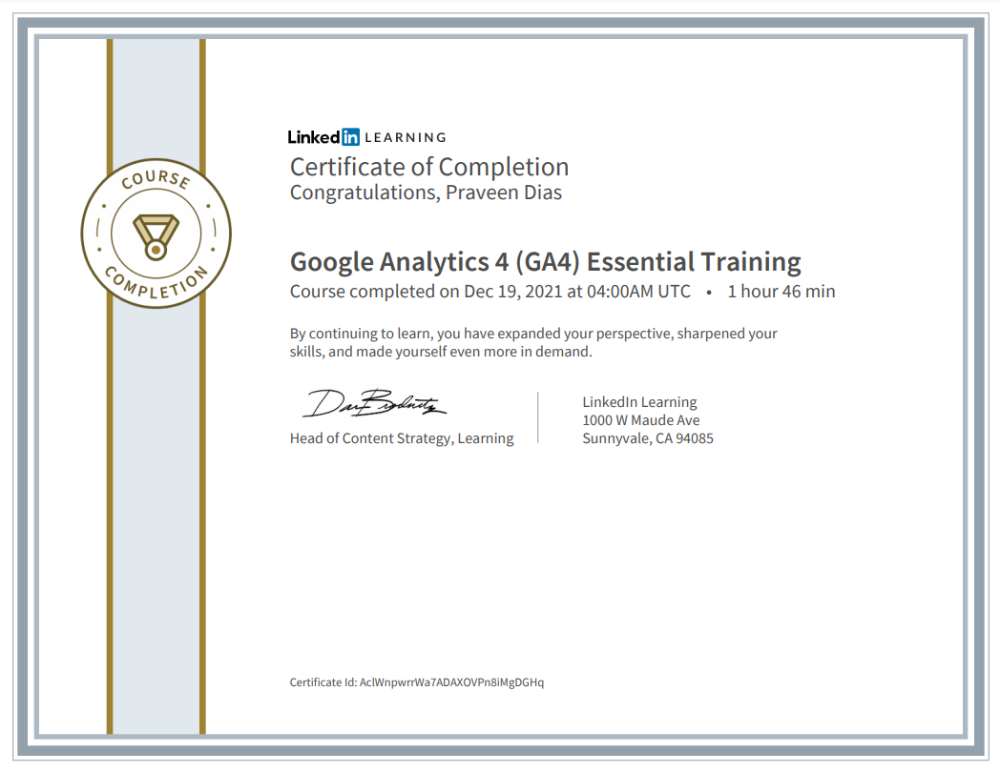

# Google Analytics 4 - GA4

## with Google Tag Manager GTM

This is the GA4 playground for the course.

https://www.linkedin.com/learning/google-analytics-4-ga4-essential-training

# GA4 with WASP - Cardinal Path

# ✈️ Navigating GA4 Properties ✈️

# UTM Builder

This tool allows you to easily add campaign parameters to URLs so you can measure Custom Campaigns in Google Analytics.

https://ga-dev-tools.web.app/campaign-url-builder/

## GitHub README promotion: Click the below link ✔️

https://test-ga4-5ba53.web.app?utm_source=GitHub&utm_medium=social&utm_campaign=GitHub+README+Promo&utm_id=GitHub+Promo&utm_content=README+link

# GA4 | Technique: Funnel Exploration

 One of the most improved features of Google Analytics 4 is the funnel analysis. It is much better. Previous versions of Google Analytics funnels were really inflexible. They really only worked if your site just happened to line up exactly how they were designed to work, and most of them didn't. The new version pulls in features that were previously only available in the enterprise version, and it's actually even a little bit better. So for now, for free, you are getting a better funnel analysis tool than you get in the $150,000 enterprise license.

I think these funnels are incredibly powerful. I encourage you to add a few for whatever flows that you're tracking for your users.

# LinkedIn Certification

