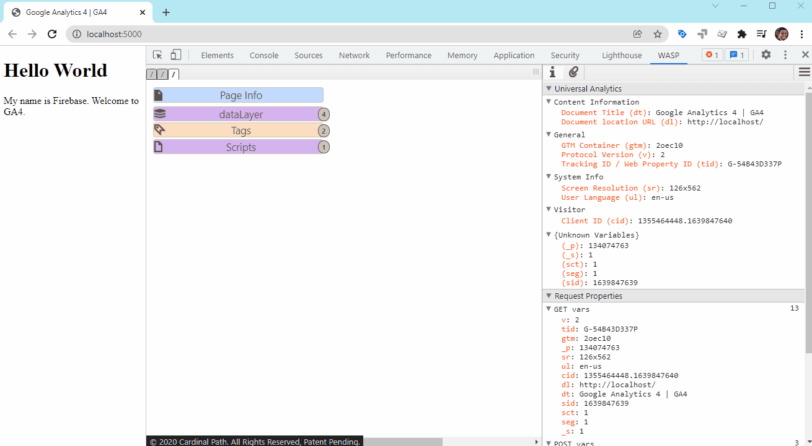
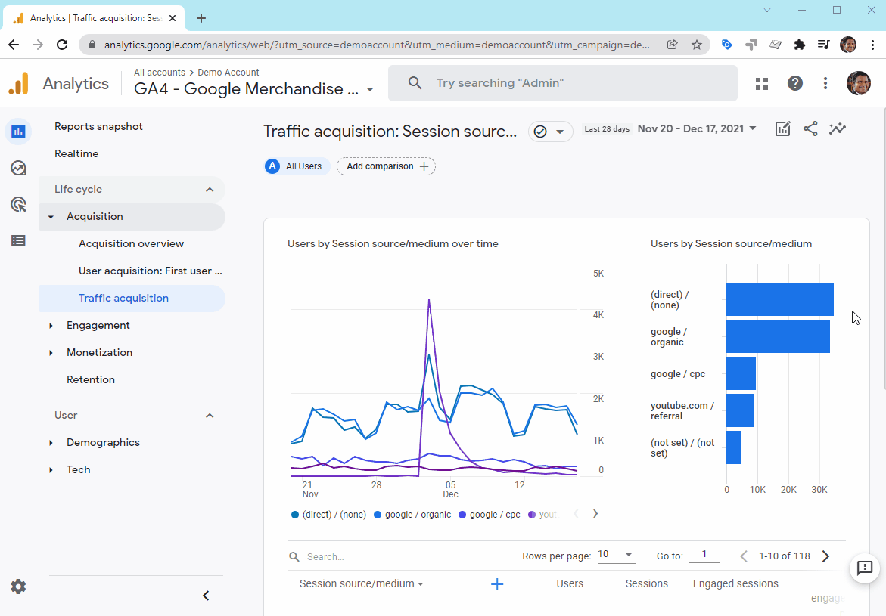

# Google Analytics 4 - GA4

## with Google Tag Manager GTM

This is the GA4 playground for the course.

https://www.linkedin.com/learning/google-analytics-4-ga4-essential-training

# GA4 with WASP - Cardinal Path

# ✈️ Navigating GA4 Properties ✈️

# UTM Builder

This tool allows you to easily add campaign parameters to URLs so you can measure Custom Campaigns in Google Analytics.

https://ga-dev-tools.web.app/campaign-url-builder/